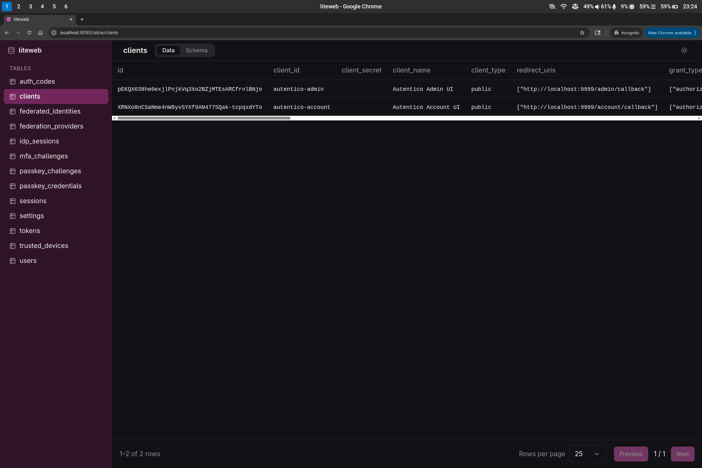

# liteweb

A fast, single-binary SQLite database viewer with a web UI. Open any SQLite file and browse its tables, inspect schemas and explore data — all from your browser.



## Features

- Single self-contained binary — no runtime dependencies
- Browse tables and views with pagination
- Inspect column types, primary keys and indexes
- Optional password protection
- Light and dark mode

## Installation

### From a GitHub release

Download the latest binary for your platform from the [releases page](https://github.com/eugenioenko/liteweb/releases).

```bash
# Linux (amd64)
curl -L https://github.com/eugenioenko/liteweb/releases/latest/download/liteweb-linux-amd64.tar.gz | tar xz
chmod +x liteweb
./liteweb --file ./mydb.sqlite
```

Available release archives:

| Platform       | File                                  |
|----------------|---------------------------------------|
| Linux x86_64   | `liteweb-linux-amd64.tar.gz`          |
| Linux arm64    | `liteweb-linux-arm64.tar.gz`          |
| macOS x86_64   | `liteweb-darwin-amd64.tar.gz`         |
| macOS arm64    | `liteweb-darwin-arm64.tar.gz`         |
| Windows x86_64 | `liteweb-windows-amd64.zip`           |

### From source

Requirements: [Go 1.25+](https://go.dev/dl/), [Node.js 22+](https://nodejs.org/), [pnpm](https://pnpm.io/)

```bash
git clone https://github.com/eugenioenko/liteweb.git
cd liteweb
make build
./liteweb --file ./mydb.sqlite
```

## Usage

```bash
$ liteweb help

  liteweb — SQLite Viewer

  A fast, single-binary SQLite database viewer with a web UI.

  Usage:
    liteweb --file <path> [options]
    liteweb help

  Options:
    --file      <path>    Path to the SQLite database file (required)
    --port      <number>  Port to listen on (default: 9090)
    --password  <string>  Password to protect the UI (optional)

  Examples:
    liteweb --file ./mydb.sqlite
    liteweb --file ./mydb.sqlite --port 8080
    liteweb --file ./mydb.sqlite --password secret
```

## Development

```bash
# Build the Go backend only (requires dist to exist)
make build-go

# Start the Vite dev server (proxies /api/ to :9090)
make ui-dev

# Run tests
make test
```

---

> This project was built with the assistance of [Claude Code](https://claude.ai/claude-code) to fulfil the need of viewing SQLite databases with a single portable binary.
